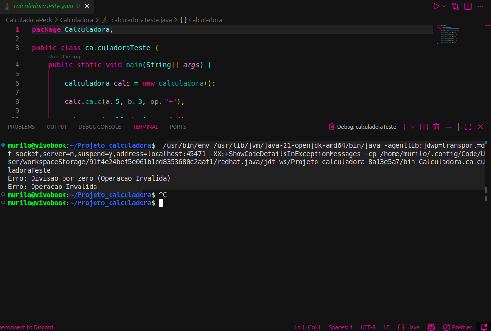

# 💻 Exercicio-de-Refatoração - Calculadora Financeira

Este repositório contém a atividade individual de **Refatoração, Testes Unitários e Documentação Javadoc** da disciplina de UX/UI e Testes de Software. O projeto consiste na implementação inicial de uma calculadora (branch `main`) e sua subsequente refatoração e documentação (branch `Refatoracao`).

---

##  Requisitos de Entrega

O exercício foi estruturado em duas branches distintas para atender aos requisitos:

1.  **Branch `main`:** Contém a implementação inicial (sem refatoração).
2.  **Branch `Refatoracao`:** Contém o código refatorado, os testes ajustados e a documentação Javadoc gerada.

---

##  Estrutura do Projeto

```
# 💻 Exercicio-de-Refatora-o - Calculadora Financeira

Este repositório contém a atividade individual de **Refatoração, Testes Unitários e Documentação Javadoc** da disciplina de UX/UI e Testes de Software. O projeto consiste na implementação inicial de uma calculadora (branch `main`) e sua subsequente refatoração e documentação (branch `Refatoracao`).

---

##  Requisitos de Entrega

O exercício foi estruturado em duas branches distintas para atender aos requisitos:

1.  **Branch `main`:** Contém a implementação inicial (sem refatoração).
2.  **Branch `Refatoracao`:** Contém o código refatorado, os testes ajustados e a documentação Javadoc gerada.

---

##  Estrutura do Projeto

A estrutura de pastas utilizada no projeto é a seguinte:


Projeto\_calculadora/
├── CalculadoraPeck
│   └── Calculadora
│       ├── Calculadora.java
│       ├── calculadoraTeste.java
│       └── public
│           ├── testeRefatorado.png  \<- Print do teste refatorado (FINAL)
│           └── testeSemRefatoracao.png
├── docs/                      \<- Documentação Javadoc gerada em HTML
└── README.md

```

---

##  Detalhes da Refatoração (Branch `Refatoracao`)

A refatoração buscou melhorar a manutenibilidade e a clareza do código, baseada no princípio de Responsabilidade Única (SRP):

* **Isolamento de Lógica:** As operações básicas (`somar`, `subtrair`, etc.) foram isoladas em **métodos privados**.
* **Tratamento de Exceções:** O controle de erro para divisão por zero e comandos inválidos utiliza o lançamento de **exceções** (`IllegalArgumentException`).
* **Sintaxe:** O método principal `calc()` utiliza o **switch expression (`->`)** do Java para simplificar o código.

###  Documentação

Todas as classes e métodos estão documentados com **Javadoc** (incluindo tags `@param`, `@return` e `@throws`), e a documentação em HTML foi gerada na pasta `docs/`.

---

##  Resultado do Teste Final

A imagem abaixo demonstra o resultado da execução da classe `calculadoraTeste.java` após a refatoração, validando tanto as operações corretas quanto a **captura bem-sucedida das exceções**
---


## Versão original 


---
## Versão Refatorada 


##  Status de Entrega (25/11)

| Item de Requisito | Status |
| :--- | :--- |
| Branch `Refatoracao` | ✔️ |
| Classes Refatoradas | ✔️ |
| Testes Ajustados (Captura de Exceções) | ✔️ |
| Documentação Javadoc | ✔️ |
| README.md com Imagem do Teste Final | ✔️ |
```
